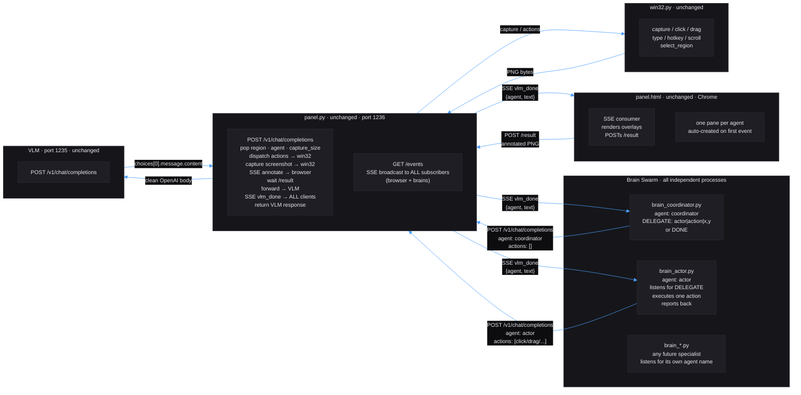

# Franz — Future Architecture

This document describes the **ultimate target state** of the Franz framework.
It is written for both humans and AI assistants. Any plan or improvement proposal
must be evaluated against this goal. If a proposed change moves the system away
from this target, it must be rejected or redesigned.

---

## Core Philosophy (never violate)

- **Zero coupling.** No file imports another Franz file. Every process is independently startable.
- **No shared state.** All coordination happens through HTTP and SSE — never through shared memory, files, or databases.
- **Stateless VLM.** The OpenAI `/chat/completions` API is used by design. Every request is self-contained.
- **No third-party dependencies.** `urllib.request`, `subprocess`, `ctypes`, `threading`, `queue` — stdlib only.
- **Windows 11 + Chrome only.** No cross-platform code, no compatibility layers.
- **Minimal code.** Every line must earn its place. No fallbacks, no dead paths, no magic values outside frozen dataclasses.

---

## Ultimate Goal: Autonomous Multi-Brain Swarm

The end state is a **swarm of cooperating AI brains** that observe a shared screen region,
divide tasks, and execute Win32 actions in a coordinated, turn-based manner — all without
any changes to `panel.py`, `win32.py`, or `panel.html`.

The SSE broadcast (`GET /events`) is the **only inter-brain channel**. It already exists.
Brains just need to connect to it.

---

## Target Architecture



---

## How the Swarm Works

### Turn-based protocol (no locks needed)

```
coordinator observes screen
  → outputs: DELEGATE: actor|click|450,320
    → actor reads vlm_done where agent=="coordinator"
    → actor parses DELEGATE line
    → actor executes the action via panel POST
    → actor reports: DONE: clicked 450,320
      → coordinator reads vlm_done where agent=="actor"
      → coordinator decides next step
```

At most one brain sends actions at any time. Win32 race condition is structurally impossible.

### SSE listener pattern (every swarm brain must implement this)

Every brain that participates in the swarm opens a background thread on startup:

```python
import queue, threading, urllib.request, json

_inbox: queue.Queue[dict] = queue.Queue()

def _sse_listener() -> None:
    while True:
        try:
            with urllib.request.urlopen("http://127.0.0.1:1236/events", timeout=None) as r:
                for raw in r:
                    line = raw.decode().strip()
                    if line.startswith("data:"):
                        obj = json.loads(line[5:])
                        if obj.get("agent") != MY_AGENT_FILTER:
                            _inbox.put(obj)
        except Exception:
            import time; time.sleep(1)

threading.Thread(target=_sse_listener, daemon=True).start()
```

`annotated_b64` must be stripped before putting into the inbox — it is large and never needed by brains.

### VLM prompt contract for swarm brains

The 0.8B–2B Qwen model requires format-enforced, single-line output. Every swarm prompt must:

- State the exact output format on line 1 of the system prompt
- Give one concrete example
- Forbid any other text

Coordinator system prompt example:
```
You control a screen. Output exactly one line.
Format: DELEGATE: <agent>|<action>|<x>,<y>  or  DONE
Example: DELEGATE: actor|click|500,320
No other text.
```

Actor system prompt example:
```
You execute one action. Read the DELEGATE line. Output exactly:
DONE: <what you did>
Example: DONE: clicked 500,320
No other text.
```

---

## File Inventory — Target State

| File | Status | Role |
|---|---|---|
| `panel.py` | **Unchanged forever** | HTTP server, SSE hub, VLM proxy, Win32 dispatcher |
| `panel.html` | **Unchanged forever** | Browser UI, overlay renderer, SSE consumer |
| `win32.py` | **Unchanged forever** | Win32 subprocess tool |
| `brain_aimbot_new.py` | Keep / evolve | Single-brain head detection loop, reference implementation |
| `brain_mspaint_new.py` | Keep / evolve | Single-brain MS Paint automation, reference implementation |
| `brain_coordinator.py` | **New — to build** | Swarm coordinator brain |
| `brain_actor.py` | **New — to build** | Swarm actor brain, executes delegated actions |
| `panel_tester.py` | Keep | Integration test harness, 20 tests |

No new files in `panel.py`, `win32.py`, or `panel.html` are ever needed for swarm functionality.

---

## Code Quality Targets (apply to every file)

- `@dataclass(frozen=True)` for all configuration — no bare module-level magic values
- No comments anywhere — code must be self-documenting
- No slicing or truncating of data
- No functional fallbacks or dead branches
- Full Pylance/pyright compatibility — every variable typed
- Pattern matching (`match`/`case`) for all dispatch logic
- No non-ASCII characters in any `.py` file

### Known violations in current codebase (must be fixed before swarm work)

| File | Issue |
|---|---|
| `brain_aimbot_new.py` | Bare `_ENDPOINT`, `_MODEL` constants — must move to `@dataclass(frozen=True)` |
| `brain_mspaint_new.py` | Same bare constants + mutable module-level `_step: int` |
| `win32.py` | `Win32Config` uses `@dataclass(slots=True)` — must be `frozen=True` |
| `panel.html` | `agentColor._map` state stored on function object — anti-pattern |

---

## Coordinate System (never changes)

All positions in actions and overlays use **normalized 0–1000 space** relative to the selected region.
`0,0` = top-left, `1000,1000` = bottom-right. `win32.py` converts to real pixels. Brain logic is
resolution-independent.

---

## API Contract (never changes)

### Brain → Panel request

```json
{
  "model": "qwen3.5-0.8b",
  "stream": false,
  "region": "x1,y1,x2,y2",
  "agent": "my-brain-name",
  "capture_size": [640, 640],
  "messages": [
    {"role": "system", "content": "..."},
    {"role": "user", "content": [
      {"type": "text", "text": "..."},
      {"type": "image_url", "image_url": {"url": ""}},
      {"type": "actions", "actions": [...]}
    ]}
  ]
}
```

`region`, `agent`, `capture_size` are popped by panel before forwarding to VLM.
`image_url.url = ""` triggers a live screenshot capture.

### Panel → Brain SSE events

`vlm_done` event (the only one brains need):
```json
{
  "request_id": "uuid",
  "agent": "my-brain-name",
  "text": "VLM response text",
  "annotated_b64": "base64png"
}
```

Brains must discard `annotated_b64` — it is for the browser only.

### Available actions

| Action | Fields |
|---|---|
| `click` | `x`, `y` |
| `double_click` | `x`, `y` |
| `right_click` | `x`, `y` |
| `drag` | `x1`, `y1`, `x2`, `y2` |
| `type_text` | `text` |
| `press_key` | `key` |
| `hotkey` | `keys` |
| `scroll_up` | `x`, `y`, `clicks` |
| `scroll_down` | `x`, `y`, `clicks` |

### Overlay format

```json
{
  "type": "overlay",
  "points": [[x1, y1], [x2, y2]],
  "stroke": "#ff4455",
  "stroke_width": 2,
  "closed": false,
  "fill": "rgba(255,68,85,0.15)"
}
```

---

## How to Run

### 1. VLM server (port 1235)

```
llama-server --model qwen3.5-0.8b.gguf --port 1235
```

Any OpenAI-compatible server works.

### 2. Panel

```
python panel.py
```

### 3. Browser

Navigate to `http://127.0.0.1:1236` in Chrome.

### 4. Single brain

```
python brain_aimbot_new.py
```

Two region selectors on startup. First drag = screen region. Second drag = capture scale (Escape = keep 640×640).

### 5. Swarm (target state)

```
python brain_coordinator.py
python brain_actor.py
```

Both connect to `/events` in background threads. Coordinator observes and delegates.
Actor listens for `DELEGATE` lines and executes. No other setup needed.

---

## Testing

### panel_tester.py — integration harness

```
python panel_tester.py
```

Same two-drag startup. Walks 20 tests sequentially. Press Enter to run, `s`+Enter to skip.
Recommended surface: MS Paint with grey brush, region cropped to white canvas only.

| ID | Name | Verifies |
|---|---|---|
| T01 | Parrot click center | Full round-trip: action + overlay + VLM echo |
| T02 | No-image text only | Panel handles missing `image_url` |
| T03 | Screenshot only | Capture pipeline, annotate/result cycle |
| T04 | Right-click center | `right_click` + orange overlay |
| T05 | Double-click center | `double_click` timing |
| T06 | Drag TL→BR | `drag` stroke |
| T07 | Drag TR→BL | Second crossing stroke |
| T08 | Drag horizontal top | Horizontal edge stroke |
| T09 | Drag vertical left | Vertical edge stroke |
| T10 | Click corners ×4 | Edge coordinate mapping |
| T11 | Type text *(prep)* | `type_text` keyboard dispatch |
| T12 | Press key Escape *(prep)* | Single key press |
| T13 | Hotkey Ctrl+Z *(prep)* | Multi-key hotkey |
| T14 | Scroll up center | `scroll_up` 5 clicks |
| T15 | Scroll down center | `scroll_down` 5 clicks |
| T16 | Multi-overlay shapes | Filled rect, open polyline, closed triangle |
| T17 | Multi-agent alpha | New browser pane creation |
| T18 | Multi-agent beta | Third pane + grid reflow |
| T19 | Capture size 320×320 | `capture_size` override |
| T20 | Full combo | drag + click + overlays — full pipeline stress |

### Manual SSE verification (no brain needed)

```
curl -N http://127.0.0.1:1236/events
```

In a second terminal, fire a test request:

```
curl -s -X POST http://127.0.0.1:1236/v1/chat/completions \
  -H "Content-Type: application/json" \
  -d "{\"model\":\"test\",\"stream\":false,\"agent\":\"test-a\",\"messages\":[{\"role\":\"user\",\"content\":\"hello\"}]}"
```

The SSE terminal must print both `annotate` and `vlm_done` events for `agent: test-a`.
This confirms the broadcast channel that swarm brains rely on is working.

### Swarm smoke test (target state)

1. Start VLM, panel, browser.
2. Start `brain_coordinator.py` and `brain_actor.py` in separate terminals.
3. In the browser, verify two panes appear: `coordinator` and `actor`.
4. Observe `coordinator` pane: must show `DELEGATE: actor|...|...` lines.
5. Observe `actor` pane: must show `DONE: ...` lines after each delegation.
6. Verify Win32 actions execute on screen (cursor moves, clicks land).
7. No deadlock after 10 full coordinator→actor→coordinator cycles.

---

## Logging

Panel writes structured JSONL to `franz-log.jsonl` in the project root.

```jsonl
{"event": "vlm_request", "ts": 1700000000.0, "model": "qwen3.5-0.8b", "agent": "coordinator", "overlays": 0}
{"event": "vlm_response", "ts": 1700000001.2, "duration_ms": 1200, "text": "DELEGATE: actor|click|500,320", "annotated": true}
{"event": "action_dispatched", "ts": 1700000001.0, "type": "click", "x": 500, "y": 320}
```

Use this log to debug swarm timing, action dispatch order, and VLM output quality.

---

## Known Issues (current state)

- `cursor_pos` output is not returned to the brain — panel dispatches it fire-and-forget.
- `top_k` and `presence_penalty` are non-standard OpenAI fields — pass through silently.
- No streaming support — all brains must set `"stream": false`.
- `agentColor._map` in `panel.html` stores state on a function object — cosmetic anti-pattern, does not affect functionality.

---

## What Must Never Change

These constraints are architectural invariants. Any plan that violates them must be rejected:

1. `panel.py` must never import any brain file.
2. `win32.py` must never import any panel or brain file.
3. `panel.html` must never contain brain logic or coordination state.
4. Brains must never share memory — only HTTP and SSE.
5. The VLM always receives a clean OpenAI-compatible request — no Franz fields leak through.
6. All coordinates are normalized 0–1000 — no pixel values in brain code.
7. No third-party Python packages — stdlib only.
