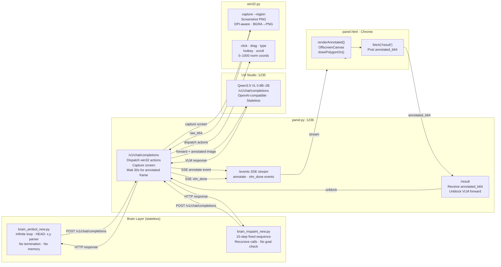
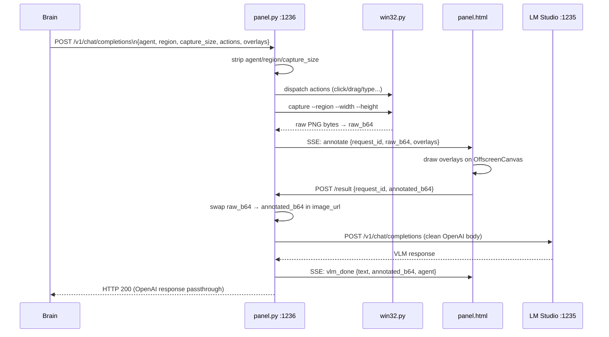
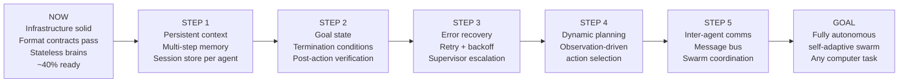
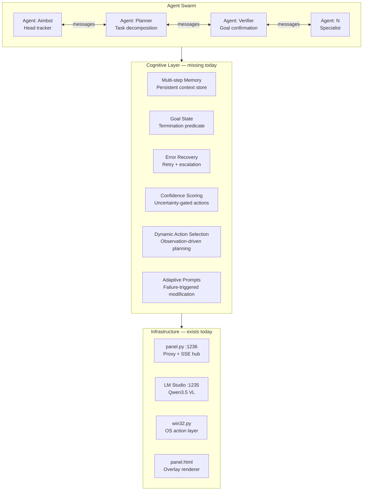

# Franz Swarm — Autonomous Computer-Control Agent System

> **Goal:** A self-adaptive swarm of AI agents that see the screen via screenshots, control the computer via keyboard and mouse, communicate with each other, and autonomously complete any computer-related task — without human intervention.

---

## Current State vs Goal State

| Dimension | Current | Goal |
|---|---|---|
| VLM format compliance | ✅ Tested, contracts pass | ✅ |
| Screen capture + action dispatch | ✅ Working | ✅ |
| Overlay annotation pipeline | ✅ Working | ✅ |
| Multi-step memory | ❌ Stateless by design | Persistent context store |
| Goal state / termination | ❌ Infinite loop / fixed count | Goal predicate per agent |
| Error recovery | ❌ None | Retry + escalation |
| Self-correction | ❌ None | Post-action verification |
| Inter-agent communication | ❌ Not implemented | Message bus |
| Dynamic action selection | ❌ Fixed sequences | Observation-driven planning |
| Confidence scoring | ❌ None | Uncertainty-gated actions |
| Adaptive prompts | ❌ Static | Failure-triggered modification |

**Overall swarm readiness: ~40%** — infrastructure is solid, the cognitive layer is missing.

---

## System Architecture



### Request lifecycle through panel.py



---

## File Map

| File | Role | Status |
|---|---|---|
| `panel.py` | HTTP proxy, action dispatcher, SSE hub, screen capture orchestrator | ✅ Working — known bugs noted below |
| `panel.html` | Browser overlay renderer, annotated image poster | ✅ Working |
| `win32.py` | Windows-only OS action layer (capture, click, drag, type, hotkey, scroll, region select) | ✅ Working |
| `brain_aimbot_new.py` | Infinite-loop head-detection brain | ✅ Working — 8 cognitive gaps |
| `brain_mspaint_new.py` | Fixed 15-step MS Paint drawing brain | ✅ Working — 8 cognitive gaps |
| `test_brain_contracts.py` | Brain cognitive contract tests (38 tests, no panel needed) | ✅ Complete |
| `test_pipeline_integration.py` | Full pipeline integration tests (37 tests, panel + Chrome) | ✅ Complete |
| `test_mock_vlm.py` | Mock VLM tests (91 tests) | ✅ Complete |
| `test_brain_contracts.json` | Output of test_brain_contracts | Runtime artifact |
| `test_pipeline_integration.json` | Output of test_pipeline_integration | Runtime artifact |
| `test_pipeline_integration.jsonl` | System log from test_pipeline_integration run | Runtime artifact |
| `test_mock_vlm.json` | Output of test_mock_vlm | Runtime artifact |
| `test_mock_vlm.jsonl` | System log from test_mock_vlm run | Runtime artifact |

### Known bugs in panel.py

- `vlm_response` log entry missing `agent` and `request_id` fields — cannot correlate response to agent under concurrent load
- Silent fallback on 30s annotate timeout — brain receives unannotated image with no error signal
- VLM forward timeout hardcoded to 360s — too long for interactive use

---

## Brain Modules

### brain_aimbot_new.py

Detects human heads in a screen region and draws circle+crosshair overlays on each detected head. Runs as an infinite loop.

```
System prompt → VLM → parse HEAD: x,y lines → _build_overlays() → 3 shapes per head → next loop iteration
```

- Coordinate space: 0–1000 normalized, mapped to screen pixels by win32.py
- Overlay: 8-point circle approximation + horizontal crosshair + vertical crosshair, stroke `#ff2233`
- **No termination condition** — loops forever regardless of detection results
- **No memory** — each HTTP call is independent, no state persists between iterations

### brain_mspaint_new.py

Executes a fixed 15-action sequence in MS Paint, observing the canvas state after each action via VLM and passing the observation forward as context to the next step.

```
on_action_execution(obs) → VLM call with [STEP N/15] label + prior obs → result → on_action_execution(result) [recursive]
```

- 15 actions: diagonal drags, edge strokes, corner clicks, double-click, right-click, scroll, border rectangle
- Recursion depth = number of remaining actions (max 15)
- **No goal verification** — executes all 15 steps regardless of whether each succeeded
- **No dynamic selection** — action sequence is fixed at import time

---

## Coordinate System

All brains, panel.py, and win32.py share a single normalized coordinate space:

```
(0,0) ─────────────────── (1000,0)
  │                            │
  │    0–1000 normalized       │
  │    mapped to screen        │
  │    pixels by win32.py      │
  │                            │
(0,1000) ──────────────── (1000,1000)
```

win32.py maps normalized coords to actual screen pixels using the selected region bounds and DPI-aware screen metrics.

---

## Test Harnesses

### test_brain_contracts.py — Brain Cognitive Contracts (38 tests)

Directly hits LM Studio at `:1235`. No panel, no Chrome required. Tests the VLM's ability to fulfill the brain contracts and documents all architectural gaps.

```
python test_brain_contracts.py
# Requires: LM Studio running at 127.0.0.1:1235 with a vision model loaded
# Output: test_brain_contracts.json
```

### test_pipeline_integration.py — Full Pipeline Integration (37 tests)

Starts panel.py, opens Chrome, runs SSE listener and auto-result pump. Tests the complete request lifecycle end-to-end.

```
python test_pipeline_integration.py
# Requires: LM Studio at :1235 + Chrome installed
# Output: test_pipeline_integration.json, test_pipeline_integration.jsonl
```

### test_mock_vlm.py — Mock VLM Tests (91 tests)

Starts a fake VLM server, starts panel.py, opens Chrome. Tests the full panel pipeline without requiring a real LM Studio instance.

```
python test_mock_vlm.py
# Requires: Chrome installed
# Output: test_mock_vlm.json, test_mock_vlm.jsonl
```

---

## Test Suite — Phase by Phase

### Phase 1 · LM Studio Connectivity (2 tests)

| Test | Why it matters |
|---|---|
| `lm_studio_reachable` | Zero agents can function without VLM reachability. This is the hard prerequisite for the entire swarm. |
| `lm_studio_model_detected` | Agents must know which model is loaded. Model detection is the first act of swarm self-awareness. |

### Phase 2 · Aimbot Format Compliance (11 tests)

| Test | Why it matters |
|---|---|
| `aimbot_sys_prompt_produces_head_format_on_described_head` | The aimbot brain contract: VLM must output `HEAD: x,y`. If this breaks, the loop produces no data. |
| `aimbot_head_coordinates_within_0_1000_range` | Out-of-range coords crash the action dispatcher or produce off-screen clicks. |
| `aimbot_no_heads_produces_no_head_lines_on_blank_image` | Hallucinated heads cause phantom mouse movements. A swarm that hallucinates targets is unsafe. |
| `aimbot_no_extra_text_beyond_head_lines` | Extra text breaks the regex parser. Machine-to-machine output must be zero-noise. |
| `aimbot_multiple_heads_produces_multiple_head_lines` | Multi-target awareness is a prerequisite for coordinating multiple agents on multiple targets. |
| `aimbot_center_head_coordinates_near_500_500` | Spatial accuracy test. Wrong position data means the agent acts on incorrect coordinates. |
| `aimbot_parse_heads_function_handles_malformed_output_gracefully` | VLMs occasionally produce malformed output. A crashed parser kills the entire loop. |
| `aimbot_overlay_generation_produces_three_shapes_per_head` | Exactly 3 shapes per head required by the overlay rendering contract with panel.html. |
| `aimbot_overlay_uses_correct_stroke_color` | Wrong color breaks the browser renderer's style application. |
| `aimbot_overlay_coordinates_match_head_position` | Misaligned overlays corrupt the annotated image fed back to the VLM in the next iteration. |
| `aimbot_zero_heads_produces_zero_overlays` | Phantom overlays on empty frames confuse the VLM in the next loop iteration. |

### Phase 3 · Mspaint Observation Quality (10 tests)

| Test | Why it matters |
|---|---|
| `mspaint_sys_prompt_produces_observation_under_80_words` | Observations over 80 words bloat the prompt and risk hitting context limits in long sequences. |
| `mspaint_observation_not_empty_for_marked_canvas` | Empty observation breaks the cognitive chain — the next step receives no context. |
| `mspaint_observation_describes_blank_canvas_as_blank` | VLM must ground descriptions in actual visual reality, not generate generic text. |
| `mspaint_action_list_has_15_entries` | Wrong count causes silent step skipping or unintended action execution. |
| `mspaint_all_actions_have_required_keys` | Missing keys cause KeyError crashes mid-sequence, leaving the computer in unknown state. |
| `mspaint_all_action_types_are_valid_win32_commands` | Unknown types are silently ignored — silent no-ops in a task sequence have no error signal. |
| `mspaint_all_overlays_have_type_overlay` | Wrong type causes panel.html to silently drop the overlay, corrupting the annotated image. |
| `mspaint_all_coordinates_within_0_1000_range` | Out-of-range coords cause win32.py to click outside the target window. |
| `mspaint_step_counter_increments_correctly` | A broken counter causes re-execution of the same step or step skipping. |
| `mspaint_observation_with_prior_context_references_prior` | Context chaining is the foundation of multi-step reasoning without persistent memory. |

### Phase 4 · Swarm Autonomy Stress (8 tests)

| Test | Why it matters |
|---|---|
| `brain_follows_explicit_format_instruction_over_natural_language` | Format discipline must override natural language tendencies — agents must prioritize structured output. |
| `brain_does_not_add_preamble_or_explanation_to_head_output` | Even one extra word before `HEAD:` corrupts the output stream for downstream parsers. |
| `brain_handles_empty_prior_observation_without_error` | Step 1 always has empty prior obs. Crashing on step 1 means the sequence never starts. |
| `brain_handles_long_prior_observation_without_truncation_error` | Long-running agents accumulate large contexts. The brain must handle them without erroring. |
| `aimbot_consistent_output_format_across_three_calls` | A 33% format failure rate makes the aimbot loop unreliable. Consistency is required. |
| `aimbot_does_not_hallucinate_heads_on_solid_color_images` | Hallucinating heads on solid-color images causes phantom mouse movements on real screens. |
| `mspaint_observation_changes_between_different_images` | If black and white canvas produce identical observations, the VLM is not actually looking at the image. |
| `brain_concurrent_calls_produce_independent_outputs` | A swarm by definition runs multiple agents in parallel. Concurrent calls must be isolated. |

### Phase 5 · Swarm Readiness Gaps (8 tests)

These tests document architectural gaps. Some always pass (they just print the gap). They are the measurement instrument for swarm readiness.

| Test | Gap documented |
|---|---|
| `brain_has_no_multi_step_memory_stateless_confirmed` | No memory across calls — unique marker in call 1 never appears in call 2 |
| `aimbot_no_goal_state_brain_loops_forever_by_design` | No termination condition — loop continues regardless of detection results |
| `mspaint_no_goal_verification_brain_cannot_confirm_task_done` | No post-action verification — executes all 15 steps regardless of success |
| `brain_no_error_recovery_mechanism_documented` | No retry/fallback — ERROR: input is processed as normal observation |
| `aimbot_head_at_edge_coordinates_still_parseable` | Spatial completeness — agents must operate across the full coordinate space |
| `mspaint_step_label_in_prompt_influences_observation_content` | Context sensitivity — agents must adapt perception based on action performed |
| `brain_swarm_readiness_score_documented` | Enumerates all 8 gaps — the definitive readiness report |

---

## 8 Documented Brain Architecture Gaps

These are the concrete missing capabilities between the current system and the ultimate swarm goal.

### GAP 1 · No multi-step memory across calls
Both brains are stateless HTTP clients. Each `/v1/chat/completions` call is independent. Agents cannot build on prior work, cannot remember what they did 5 steps ago, and cannot maintain task state across network interruptions.

**Fix:** Add a persistent context store (keyed by `agent+session`) that prepends prior observations to each new prompt.

### GAP 2 · No goal state or termination condition
The aimbot runs `while True` with no break condition. The mspaint brain stops only when `_step >= len(_ACTIONS)` — a fixed count, not a goal check. Neither brain can answer "is the task done?".

**Fix:** Define a goal predicate per brain (e.g. "no heads detected for 3 consecutive frames" for aimbot, "VLM confirms all strokes visible" for mspaint) and check it each iteration.

### GAP 3 · No error recovery or retry logic
When win32.py fails (screen capture returns empty, click misses target), the brain receives an `ERROR:` string as its observation and continues as if nothing happened. No retry, no backoff, no escalation.

**Fix:** Detect `ERROR:` prefix in observation, implement exponential backoff retry for transient failures, escalate to a supervisor agent for persistent failures.

### GAP 4 · No self-correction from failed actions
The mspaint brain executes all 15 actions in sequence regardless of whether each action succeeded. If step 3 fails, steps 4–15 execute on a wrong canvas state.

**Fix:** After each action, capture the screen and ask the VLM "did the action succeed?" before proceeding to the next step.

### GAP 5 · No inter-agent communication *(TDD)*
No message passing mechanism exists between agents. The aimbot cannot tell the mspaint brain "I detected a head at 500,500 — draw a circle there". Agents are completely isolated.

**Fix (TDD):** Implement a message bus (SSE channel or shared queue in panel.py) that allows agents to publish and subscribe to typed messages.

### GAP 6 · No dynamic action selection *(TDD)*
The mspaint brain has a fixed `_ACTIONS` list. It cannot decide "the canvas is blank, I should draw a diagonal first" vs "the canvas already has a diagonal, I should draw a horizontal".

**Fix (TDD):** Replace the fixed list with a VLM call that selects the next action from a menu based on the current observation.

### GAP 7 · No confidence scoring on VLM output *(TDD)*
The VLM produces `HEAD: x,y` with no indication of confidence. A head detected at 0.95 confidence should be treated differently from one at 0.3 confidence.

**Fix (TDD):** Add a confidence field to the output format (`HEAD: x,y CONF:0.85`) and implement confidence-gated action execution.

### GAP 8 · No adaptive prompt modification *(TDD)*
If the VLM consistently fails to produce `HEAD:` lines, the brain keeps sending the same prompt forever.

**Fix (TDD):** After N consecutive parse failures, modify the system prompt to add more explicit instructions or switch to a fallback prompt.

---

## Path to Goal — Roadmap



---

## Goal Architecture

What the system needs to become:



---

## Running the Tests

**Prerequisites:**
- Python 3.13
- Windows 11
- LM Studio running at `127.0.0.1:1235` with a vision model loaded (Qwen3.5 VL 0.8B or 2B recommended)
- For test_harness5: Google Chrome installed

```bash
# Brain cognitive contracts (no panel needed)
python test_brain_contracts.py

# Full pipeline integration (starts panel + Chrome automatically)
python test_pipeline_integration.py

# Mock VLM tests (no LM Studio needed)
python test_mock_vlm.py
```

All scripts exit with code `0` on full pass, `1` on any failure, `2` if LM Studio is unreachable (where applicable). Each run deletes its own previous output files before starting and renames `franz-log.jsonl` to match the script name on completion.

---

## Tech Stack

| Layer | Technology |
|---|---|
| Language | Python 3.13 — strict typing, frozen dataclasses, pattern matching |
| VLM | Qwen3.5 VL 0.8B–2B via LM Studio (OpenAI-compatible API) |
| OS control | win32.py — pure ctypes, no third-party dependencies |
| Panel server | Python stdlib `http.server.ThreadingHTTPServer` |
| Browser | Latest Google Chrome, 1080p 16:9 |
| Coordinate space | 0–1000 normalized, DPI-aware mapping |
| Image format | PNG (BGRA→RGBA conversion in win32.py) |
| Logging | JSONL structured log — named per test run (`test_*.jsonl`) |
| Dependencies | Python stdlib only — no pip installs |
