# Franz

A minimal, fully modular framework for building vision-language AI agents on Windows. Five independent files. Zero coupling. Any brain you write works out of the box.

---

## Architecture

```mermaid
%%{init: {'theme': 'base', 'themeVariables': {'background': '#0d0d0f', 'primaryColor': '#1e1e24', 'primaryTextColor': '#e8e8f0', 'primaryBorderColor': '#2a2a35', 'lineColor': '#4a9eff', 'secondaryColor': '#16161a', 'tertiaryColor': '#0d0d0f', 'edgeLabelBackground': '#0d0d0f', 'clusterBkg': '#16161a', 'clusterBorder': '#2a2a35', 'titleColor': '#e8e8f0', 'nodeTextColor': '#e8e8f0', 'fontFamily': 'monospace', 'fontSize': '13px'}}}%%
flowchart LR
    DEV(["👨‍💻 Developer"])

    subgraph BRAINS ["Brain files · any number · fully independent"]
        direction TB
        BN1["brain_mspaint_new.py\nMS Paint benchmark · 15 steps"]
        BN2["brain_aimbot_new.py\nhead detection loop · continuous"]
        BN3["your_brain.py\nanything you want"]
    end

    subgraph PANEL ["panel.py · HTTP server · port 1236"]
        direction TB
        P1["POST /v1/chat/completions\n─────────────────────────\npop: region · agent · capture_size\nstrip: actions content parts\ndispatch actions → win32.py\ncapture screenshot → win32.py\nSSE annotate → browser\nwait for /result\nforward clean body → VLM\nSSE vlm_done → browser\nreturn VLM response → brain"]
        P2["GET /events\nSSE stream · keepalive 25s"]
        P3["GET /\nserve panel.html"]
        P4["POST /result\nreceive annotated PNG\nresume pending request"]
    end

    subgraph BROWSER ["panel.html · Chrome · auto-reconnects"]
        direction TB
        B1["SSE: annotate\nrender overlays via OffscreenCanvas\nPOST /result with annotated PNG"]
        B2["SSE: vlm_done\ndisplay response in agent pane\nadd history chip"]
        B3["dynamic pane per agent\ncreated on first event\npersists until page close"]
    end

    subgraph WIN32 ["win32.py · Win32 subprocess tool"]
        W1["capture --width --height --region\nclick · double_click · right_click\ndrag · type_text · press_key\nhotkey · scroll_up · scroll_down\ncursor_pos · select_region"]
    end

    subgraph VLM ["VLM server · OpenAI-compatible · port 1235"]
        V1["POST /v1/chat/completions\nreturns choices[0].message.content"]
    end

    DEV -->|"python panel.py"| PANEL
    DEV -->|"open browser"| BROWSER
    DEV -->|"python brain_*.py"| BRAINS

    BRAINS -->|"POST /v1/chat/completions\n{ region, agent, capture_size,\n  messages, actions, overlays }"| PANEL
    PANEL -->|"capture --width --height"| WIN32
    PANEL -->|"click / drag / ..."| WIN32
    WIN32 -->|"PNG bytes stdout"| PANEL
    PANEL -->|"SSE: annotate\n{ request_id, raw_b64,\n  overlays, agent }"| BROWSER
    BROWSER -->|"POST /result\n{ request_id, annotated_b64 }"| PANEL
    PANEL -->|"POST /v1/chat/completions\nclean OpenAI body + annotated image"| VLM
    VLM -->|"{ choices[0].message.content }"| PANEL
    PANEL -->|"OpenAI response"| BRAINS
    PANEL -->|"SSE: vlm_done\n{ request_id, text,\n  annotated_b64, agent }"| BROWSER
```



---

## What makes this special

Every component is a completely independent process. There is no shared state, no imports between files, no orchestrator. The system only exists when all parts run together — but none of them require the others to start.

- **panel.py** does not know what a brain is. It receives HTTP requests and serves them.
- **win32.py** does not know what panel is. It receives CLI commands and executes them.
- **panel.html** does not know what a brain is. It renders whatever SSE events arrive, creating a new pane per agent automatically.
- **A brain** does not know how panel works internally. It POSTs standard HTTP and reads standard HTTP responses.
- **The VLM** does not know Franz exists. It receives a clean OpenAI-compatible request.

---

## OpenAI API compatibility

Panel exposes `POST /v1/chat/completions` and forwards requests to a downstream VLM at `http://127.0.0.1:1235/v1/chat/completions`. Before forwarding, panel strips all Franz-internal fields so the VLM always receives a clean OpenAI request.

### Franz-internal request fields

These fields are popped by panel before the request reaches the VLM. They are safe to add to any brain request body.

| Field | Type | Default | Description |
|---|---|---|---|
| `region` | `"x1,y1,x2,y2"` | `""` | Normalized 0–1000 screen region to capture and resolve actions against |
| `agent` | `string` | `"default"` | Agent name — used by the browser to route SSE events to the correct pane |
| `capture_size` | `[width, height]` | `[640, 640]` | Pixel dimensions of the captured screenshot passed to win32 |

All other fields pass through to the VLM unchanged. Unknown fields are ignored by standard OpenAI servers.

The response returned to the brain is the raw VLM response, unmodified.

---

## Coordinate system

All positions in actions and overlays use a **normalized 0–1000 coordinate space** relative to the selected region. `0,0` is top-left, `1000,1000` is bottom-right. win32.py handles the conversion to real screen pixels. Brain logic is completely resolution-independent.

---

## How to run

### 1. Start the VLM server

Any OpenAI-compatible server on port 1235. Example with llama.cpp:

```
llama-server --model your-model.gguf --port 1235
```

### 2. Start panel

```
python panel.py
```

Panel starts a persistent HTTP server on `http://127.0.0.1:1236`. It runs until you press Ctrl+C.

### 3. Open the browser

Navigate to `http://127.0.0.1:1236` in Chrome. The panel UI connects via SSE and stays connected. If panel restarts, the browser reconnects automatically within seconds.

### 4. Run a brain (optional)

In a separate console:

```
python brain_mspaint_new.py
```

or

```
python brain_aimbot_new.py
```

Each brain starts with two region selectors. The first drag selects the screen area to observe and control. The second drag sets the capture resolution — only the horizontal width of the drag matters; both width and height are set to the same value to preserve aspect ratio. Press Escape on the second selector to keep the default 640×640.

### Get region coordinates manually

```
python win32.py select_region
```

Prints `x1,y1,x2,y2` to stdout.

---

## Testing fake requests from the command line

Use these to verify the multi-agent UI without running a brain. Each command sends a minimal valid request that panel will process and broadcast. Open `http://127.0.0.1:1236` in Chrome first.

**Agent "test-a" — no image, no actions:**
```
curl -s -X POST http://127.0.0.1:1236/v1/chat/completions -H "Content-Type: application/json" -d "{\"model\":\"test\",\"stream\":false,\"agent\":\"test-a\",\"messages\":[{\"role\":\"user\",\"content\":\"hello\"}]}"
```

**Agent "test-b" — different agent, creates a second pane:**
```
curl -s -X POST http://127.0.0.1:1236/v1/chat/completions -H "Content-Type: application/json" -d "{\"model\":\"test\",\"stream\":false,\"agent\":\"test-b\",\"messages\":[{\"role\":\"user\",\"content\":\"world\"}]}"
```

**Agent "test-c" — with region and custom capture size:**
```
curl -s -X POST http://127.0.0.1:1236/v1/chat/completions -H "Content-Type: application/json" -d "{\"model\":\"test\",\"stream\":false,\"agent\":\"test-c\",\"region\":\"0,0,1000,1000\",\"capture_size\":[320,320],\"messages\":[{\"role\":\"user\",\"content\":[{\"type\":\"image_url\",\"image_url\":{\"url\":\"\"}}]}]}"
```

---

## Available actions

All coordinates are normalized 0–1000 relative to the selected region.

| Action | Required fields | Description |
|---|---|---|
| `click` | `x`, `y` | Left click |
| `double_click` | `x`, `y` | Double left click |
| `right_click` | `x`, `y` | Right click |
| `drag` | `x1`, `y1`, `x2`, `y2` | Click-hold drag from point to point |
| `type_text` | `text` | Type a string via keyboard events |
| `press_key` | `key` | Press a single key by name |
| `hotkey` | `keys` | Press a key combination e.g. `"ctrl+z"` |
| `scroll_up` | `x`, `y`, `clicks` | Scroll wheel up at position |
| `scroll_down` | `x`, `y`, `clicks` | Scroll wheel down at position |
| `cursor_pos` | — | Fire-and-forget cursor position query (see known issues) |

Valid key names for `press_key` and `hotkey`: `enter`, `escape`, `tab`, `backspace`, `delete`, `insert`, `home`, `end`, `pageup`, `pagedown`, `up`, `down`, `left`, `right`, `ctrl`, `alt`, `shift`, `win`, `space`, `f1`–`f12`, `a`–`z`, `0`–`9`.

---

## Overlay format

Overlays are 2D polygon objects rendered on the screenshot in the browser before the image is sent to the VLM.

```json
{
  "type": "overlay",
  "points": [[x1, y1], [x2, y2], ...],
  "stroke": "#ff4455",
  "stroke_width": 2,
  "closed": false
}
```

| Field | Type | Description |
|---|---|---|
| `points` | `[[x,y], ...]` | Polygon vertices in normalized 0–1000 coords |
| `stroke` | CSS color string | Stroke color e.g. `"#ff4455"` |
| `stroke_width` | integer | Line width in pixels |
| `closed` | boolean | Whether to close the polygon (connect last point to first) |
| `fill` | CSS color string | Optional fill color |

---

## Brain template

```python
import json
import subprocess
import sys
import urllib.request
from pathlib import Path
from typing import Any

_ENDPOINT: str = "http://127.0.0.1:1236/v1/chat/completions"
_MODEL: str = "qwen3.5-0.8b"
_WIN32: Path = Path(__file__).resolve().parent / "win32.py"
_SYS: str = "Describe what you see in one sentence."

_region: str = ""
_cap_w: int = 640
_cap_h: int = 640


def _step(obs: str, step_num: int) -> str:
    actions: list[dict[str, Any]] = []
    overlays: list[dict[str, Any]] = []

    body = json.dumps({
        "model": _MODEL,
        "temperature": 0.3,
        "max_tokens": 256,
        "stream": False,
        "region": _region,
        "agent": "my-brain",
        "capture_size": [_cap_w, _cap_h],
        "messages": [
            {"role": "system", "content": _SYS},
            {"role": "user", "content": [
                {"type": "text", "text": f"[STEP {step_num}] Prior observation: {obs}"},
                {"type": "image_url", "image_url": {"url": ""}},
                {"type": "actions", "actions": actions + overlays},
            ]},
        ],
    }).encode()

    req = urllib.request.Request(
        _ENDPOINT, data=body,
        headers={"Content-Type": "application/json", "Accept": "application/json"},
        method="POST",
    )
    try:
        with urllib.request.urlopen(req, timeout=120) as resp:
            obj = json.loads(resp.read())
        choices: list[Any] = obj.get("choices", [])
        return choices[0].get("message", {}).get("content", "").strip() if choices else ""
    except Exception as exc:
        return f"ERROR: {exc}"


def run() -> None:
    obs: str = ""
    n: int = 0
    while True:
        n += 1
        obs = _step(obs, n)


if __name__ == "__main__":
    proc = subprocess.run([sys.executable, str(_WIN32), "select_region"], capture_output=True, text=True)
    if proc.returncode == 2:
        raise SystemExit(0)
    _region = proc.stdout.strip()
    proc2 = subprocess.run([sys.executable, str(_WIN32), "select_region"], capture_output=True, text=True)
    if proc2.returncode != 2 and proc2.stdout.strip():
        x1, _y1, x2, _y2 = map(int, proc2.stdout.strip().split(","))
        scale = (x2 - x1) / 1000
        _cap_w = round(1000 * scale)
        _cap_h = round(1000 * scale)
    run()
```

---

## Panel tester

`panel_tester.py` is a standalone interactive test harness for panel. It requires panel and a VLM to be running. It does **not** import any other Franz file.

```
python panel_tester.py
```

Same two-drag startup as the brains: first drag selects the region, second drag sets capture scale (Escape = keep 640×640). Then it walks through 20 numbered tests one by one, printing the VLM response after each. Press Enter to run a test or `s`+Enter to skip it.

### Recommended test surface

Open MS Paint with a grey brush selected and crop the region to the white canvas only. Grey lines drawn twice become black, making action effects visually verifiable in the browser pane.

### Test index

| ID | Name | What it verifies |
|---|---|---|
| T01 | Parrot click center | Full round-trip: click + crosshair overlay + VLM echo |
| T02 | No-image text only | Panel handles missing `image_url` |
| T03 | Screenshot only | Capture pipeline, annotate/result cycle |
| T04 | Right-click center | `right_click` action + orange square overlay |
| T05 | Double-click center | `double_click` timing |
| T06 | Drag diagonal TL→BR | `drag` stroke across canvas |
| T07 | Drag diagonal TR→BL | Second crossing stroke |
| T08 | Drag horizontal top | Horizontal edge stroke |
| T09 | Drag vertical left | Vertical edge stroke |
| T10 | Click corners ×4 | Edge coordinate mapping |
| T11 | Type text *(prep)* | `type_text` keyboard dispatch |
| T12 | Press key Escape *(prep)* | Single key press |
| T13 | Hotkey Ctrl+Z *(prep)* | Multi-key hotkey, undoes last stroke |
| T14 | Scroll up center | `scroll_up` 5 clicks |
| T15 | Scroll down center | `scroll_down` 5 clicks |
| T16 | Multi-overlay shapes | Filled rect, open polyline, closed triangle |
| T17 | Multi-agent alpha | New browser pane creation |
| T18 | Multi-agent beta | Third pane + grid column reflow |
| T19 | Capture size 320×320 | `capture_size` override preserved by `setdefault` |
| T20 | Full combo | drag + click + overlays — full pipeline stress test |

Tests marked *(prep)* set `needs_prep=True` and prompt you to prepare the target window before confirming.

---

## Known issues

**`cursor_pos` returns nothing to the brain.** Panel dispatches `cursor_pos` to win32.py as a fire-and-forget subprocess call. win32.py prints the normalized coordinates to stdout, but panel does not capture or return that output.

**`top_k` and `presence_penalty` are not OpenAI standard fields.** They pass through to the VLM unchanged. Standard OpenAI API servers will ignore unknown fields.

**No streaming support.** All brains set `"stream": false`. Panel does not implement streaming response forwarding.

---

## Files

| File | Role | Run directly |
|---|---|---|
| `panel.py` | HTTP server, screenshot capture, SSE, VLM proxy | `python panel.py` |
| `panel.html` | Browser UI, overlay renderer, multi-agent SSE client | served by panel.py |
| `win32.py` | Win32 input/capture subprocess tool | `python win32.py <command>` |
| `brain_mspaint_new.py` | MS Paint benchmark brain, 15 steps | `python brain_mspaint_new.py` |
| `brain_aimbot_new.py` | Head detection loop brain, continuous | `python brain_aimbot_new.py` |
| `panel_tester.py` | Interactive panel test harness, 20 payloads | `python panel_tester.py` |
